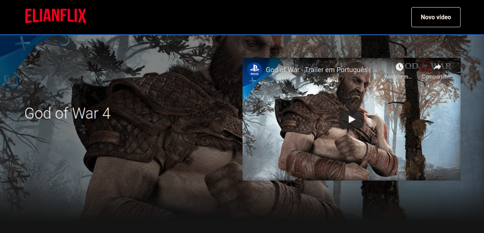
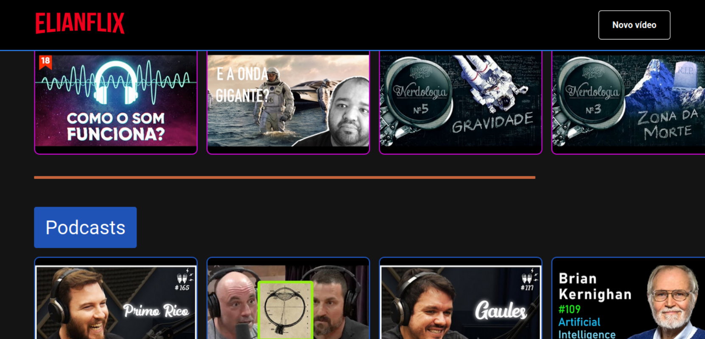

# Elianflix
Uma aplicação Frontend feita com ReactJs inpirada na Netflix. Esta aplicação desenvolvida durante a semana Imersão React da Alura.

### Backend
O Backend da aplicação foi feito utilizando a dependência json-server, que possibilita uma interface restful através de um arquivo
json que representa o banco de dados. Conforme novos dados são adicionados, o json de dados é atualizado.

### Frontend
O Frontend foi todo feito através do ReactJS, e utilizando algumas dependências para melhor desenvolvimento dos componentes,
como o styled-components, e slick-slider.
